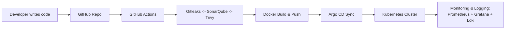
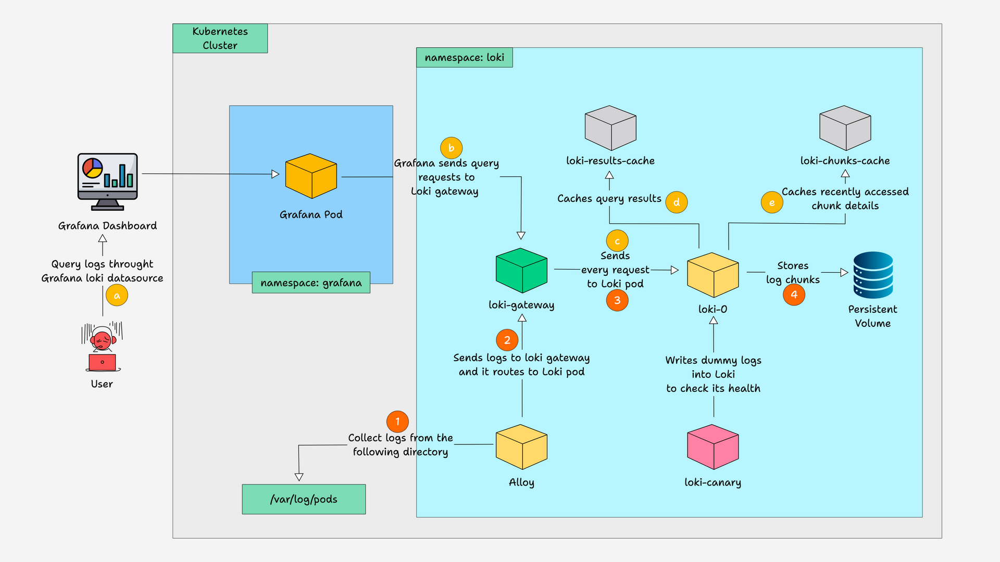

# DevConnector V2 🚀

A full-stack **MERN (MongoDB, Express, React, Node.js)** social network application.
Originally forked from [Brad Traversy’s DevConnector](https://github.com/bradtraversy/devconnector), this project was extended with a **complete GitOps-powered DevSecOps pipeline** to showcase modern software delivery practices.

---

## 🌟 Features

### Application

* MERN stack social network app for developers
* User authentication & profiles
* Posts, comments, and likes
* MongoDB for persistence

### What Is Added 🛠️

* **GitOps + CI/CD pipeline** (GitHub Actions → Argo CD → Kubernetes)
* **Security scanning & quality checks** in the pipeline:

  * 🔐 [Gitleaks](https://github.com/gitleaks/gitleaks) – secrets scanning
  * 🧪 [SonarQube](https://www.sonarqube.org/) – code quality & static analysis
  * 🛡️ [Trivy](https://aquasecurity.github.io/trivy/) – container image vulnerability scanning
* **Containerized deployment** with Docker
* **Kubernetes manifests** for scalable deployment
* **Argo CD GitOps** for declarative, automated delivery
* **Monitoring & Observability**:

  * 📊 Prometheus – metrics
  * 📉 Grafana – dashboards
  * 🚨 Alertmanager – alerting
  * 📜 Loki + Grafana Alloy – log aggregation

---

## ⚙️ CI/CD & GitOps Workflow



flowchart TD
    A[Developer] -->|Push Code| B[GitHub Repo]
    B --> C[GitHub Actions CI/CD]
    C --> D[Gitleaks]
    C --> E[SonarQube]
    C --> F[Trivy Scan]
    C --> G[Docker Build & Push]
    G --> H[Container Registry]

    H --> I[ArgoCD GitOps]
    I --> J[Kubernetes Cluster]
    J --> K[Node.js App (DevConnectorV2)]

    subgraph Monitoring
        L[Prometheus] --> M[Grafana]
        K --> L
        K --> N[Loki Logs]
        N --> M
        L --> O[Alertmanager]
    end

    J --> Monitoring

sequenceDiagram
    participant Dev as Developer
    participant GH as GitHub
    participant GA as GitHub Actions
    participant Sec as Security Tools
    participant Reg as Docker Registry
    participant Argo as ArgoCD
    participant K8s as Kubernetes

    Dev->>GH: Push Code
    GH->>GA: Trigger Workflow
    GA->>Sec: Run Gitleaks, SonarQube, Trivy
    GA->>Reg: Build & Push Docker Image
    Reg->>Argo: New Image Available
    Argo->>K8s: Sync Deployment
    K8s->>Dev: App Running with Monitoring





**Flow:**

1. Code is pushed to **GitHub**
2. **GitHub Actions** pipeline runs:

   * Secrets scanning (Gitleaks)
   * Code quality (SonarQube)
   * Vulnerability scanning (Trivy)
   * Build & push Docker image
3. **Argo CD** automatically syncs manifests to Kubernetes
4. Application runs on **Kubernetes cluster**
5. **Monitoring + Alerting** with Prometheus, Grafana, Alertmanager
6. **Centralized Logging** with Loki + Grafana Alloy

---

## 📊 Monitoring Stack

* **Grafana Dashboards** for:

  * Application performance
  * Node.js service metrics
  * Kubernetes cluster health
* **Prometheus** scraping metrics
* **Alertmanager** configured for alert routing
* **Loki + Alloy** integrated with Grafana for log visualization

---

## 🔎 How to Run Locally

### Clone the repo

```bash
git clone https://github.com/gauravchoudhary1998/devConnectorV2.git
cd devConnectorV2
```

### Install dependencies

```bash
npm install
```

### Run backend & frontend

```bash
npm run dev
```

---

## 🎯 Purpose

This project is built to **showcase** a **portfolio-grade DevOps/DevSecOps project** to demonstrate:

* End-to-end CI/CD pipelines
* GitOps-driven deployments
* Modern monitoring & logging stack
* Secure and production-grade DevOps practices

---

## 🤝 Acknowledgments

* [Brad Traversy](https://github.com/bradtraversy) for the original DevConnector project
* Open-source tools powering the DevOps setup

---

