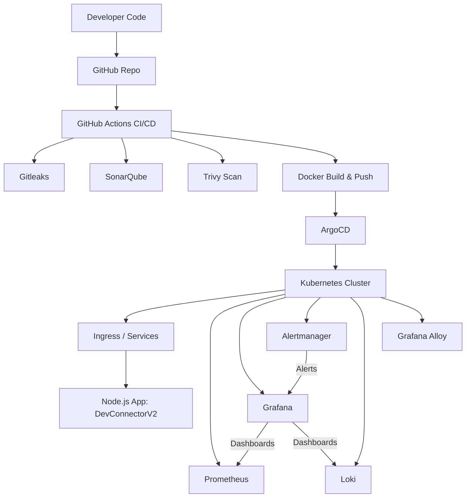
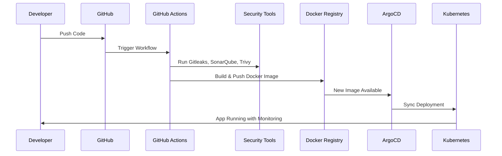

# DevConnector V2 🚀

A full-stack **MERN (MongoDB, Express, React, Node.js)** social network application.
Originally forked from [Brad Traversy’s DevConnector](https://github.com/bradtraversy/devconnector), this project was extended with a **complete GitOps-powered DevSecOps pipeline** to showcase modern software delivery practices.

---

## 🌟 Features

### Application

* MERN stack social network app for developers
* User authentication & profiles
* Posts, comments, and likes
* MongoDB for persistence

### What Is Added 🛠️

* **GitOps + CI/CD pipeline** (GitHub Actions → Argo CD → Kubernetes)
* **Security scanning & quality checks** in the pipeline:

  * 🔐 [Gitleaks](https://github.com/gitleaks/gitleaks) – secrets scanning
  * 🧪 [SonarQube](https://www.sonarqube.org/) – code quality & static analysis
  * 🛡️ [Trivy](https://aquasecurity.github.io/trivy/) – container image vulnerability scanning
* **Containerized deployment** with Docker
* **Kubernetes manifests** for scalable deployment
* **Argo CD GitOps** for declarative, automated delivery
* **Monitoring & Observability**:

  * 📊 Prometheus – metrics
  * 📉 Grafana – dashboards
  * 🚨 Alertmanager – alerting
  * 📜 Loki + Grafana Alloy – log aggregation

---

## ⚙️ CI/CD & GitOps Workflow


High Level Diagram



CI/CD Flow



Prometheus Metrics Flow

```mermaid
flowchart LR
    A["Node.js App (DevConnectorV2)"] -->|Exposes /metrics (Prometheus client)| B["Kubernetes Service"]
    B --> C["Prometheus Server"]

    subgraph Prometheus
        C --> D["TSDB (Time Series Database)"]
        C --> E["Alerting Rules"]
    end

    E --> F["Alertmanager"]
    F --> G["Notification Channels (Email, Slack, etc.)"]

    D --> H["Grafana Dashboards"]

    subgraph Grafana
        H --> I["Visualizations (CPU, Memory, Errors, Latency, etc.)"]
    end
```

Loki Workflow


**Flow:**

1. Code is pushed to **GitHub**
2. **GitHub Actions** pipeline runs:

   * Secrets scanning (Gitleaks)
   * Code quality (SonarQube)
   * Vulnerability scanning (Trivy)
   * Build & push Docker image
3. **Argo CD** automatically syncs manifests to Kubernetes
4. Application runs on **Kubernetes cluster**
5. **Monitoring + Alerting** with Prometheus, Grafana, Alertmanager
6. **Centralized Logging** with Loki + Grafana Alloy


---

## 📊 Monitoring Stack

* **Grafana Dashboards** for:

  * Application performance
  * Node.js service metrics
  * Kubernetes cluster health
* **Prometheus** scraping metrics
* **Alertmanager** configured for alert routing
* **Loki + Alloy** integrated with Grafana for log visualization

---

## 🔎 How to Run Locally

### Clone the repo

```bash
git clone https://github.com/gauravchoudhary1998/devConnectorV2.git
cd devConnectorV2
```

### Install dependencies

```bash
npm install
```

### Run backend & frontend

```bash
npm run dev
```

---

## 🎯 Purpose

This project is built to **showcase** a **portfolio-grade DevOps/DevSecOps project** to demonstrate:

* End-to-end CI/CD pipelines
* GitOps-driven deployments
* Modern monitoring & logging stack
* Secure and production-grade DevOps practices

---

## 🤝 Acknowledgments

* [Brad Traversy](https://github.com/bradtraversy) for the original DevConnector project
* Open-source tools powering the DevOps setup

---

